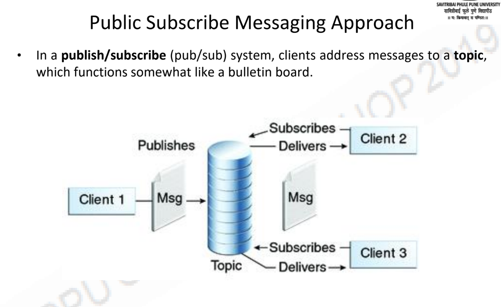
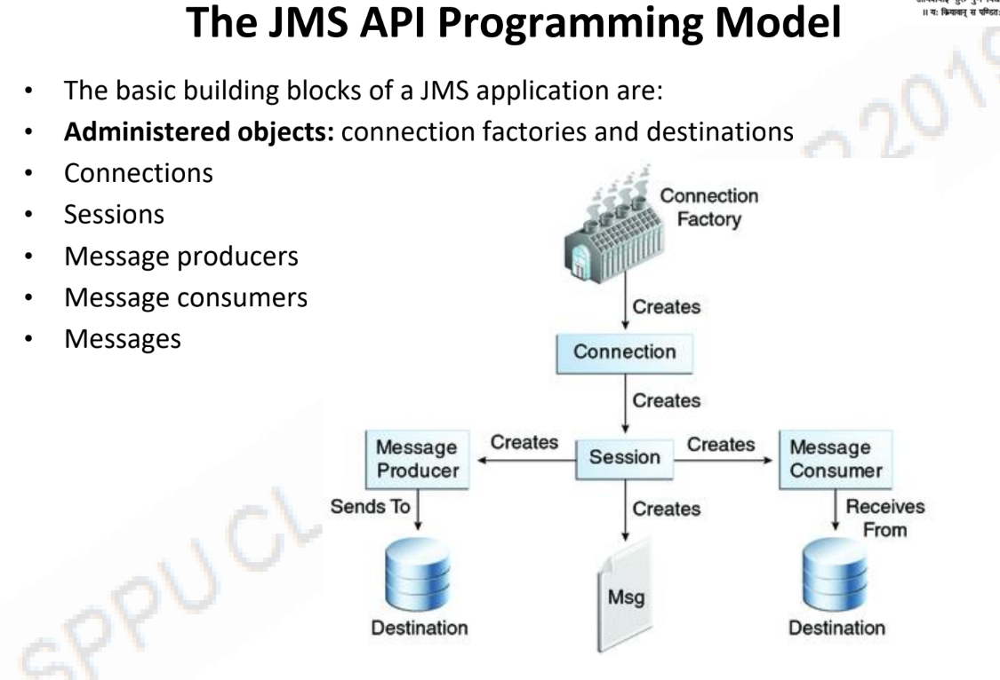

# Messaging system in Publish-Subscribe Paradigm

1. Java Message Service (JMS) is a Java API that allows applications to create, send, receive, and read messages.
2. JMS Application is composed of :
   1. **JMS Provider** - Implements JMS Interfaces
   2. **JMS Client** - Programs that produce or consume messages
   3. **Messages** - Objects that communicate information between JMS

## Publish Subscribe Messaging Approach

1. Clients address messages to a topic.
2. Publishers and subscribers are generally anonymous and can dynamically publish or subscribe to the content hierarchy.
3. The system takes care of distributing the messages arriving from a topic's multiple publishers to its multiple subscribers.

 
 

## JMS API Programming Model

